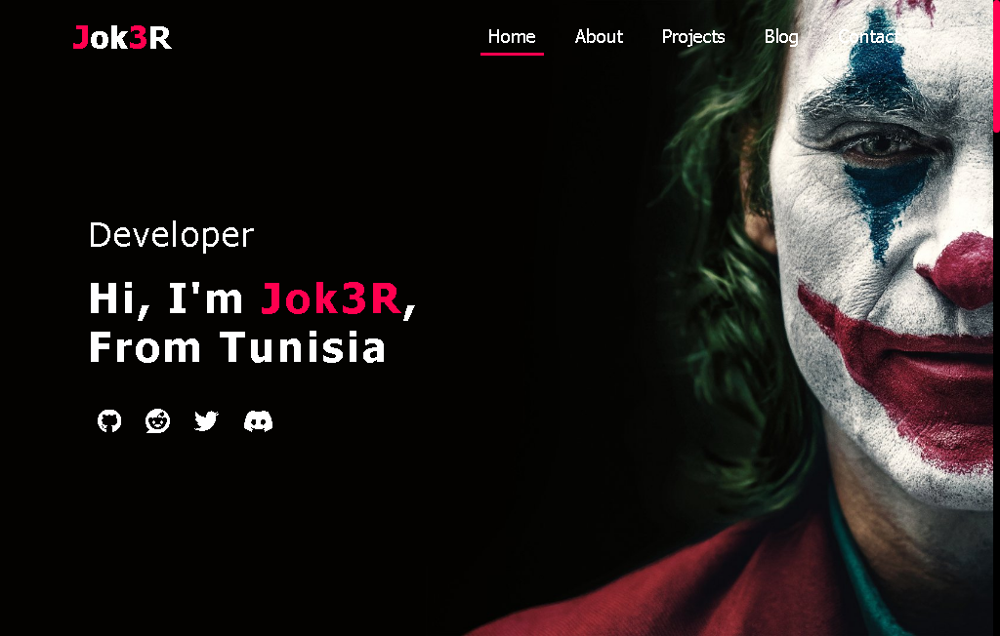

# Joker Portfolio


> A Joker theme portfolio to share your skills and projects around people!

## Features
  * Easy to run
  * Includes admin page
  * No external keys needed
  * portfolio.config.json File So You Dont Need To Edit The Code
  * Clean and smooth Design
  * The website is responsive for PC/Tablet and Mobile
  * More Updates In Future
### Requirements
  * Python +3.8V
  * Django
  * Virtualenv
### Setup
 1. Clone the repository:
 ```bash
git clone https://github.com/Jock3r99/Joker-Portfolio.git
 ```
 2. Navigate to the project directory:
```bash
 cd 'Joker-Portfolio'
```
 3. Create and activate a new virtual environment:
```bash
 python -m venv env
 source env/bin/activate
```
  4. Install the project dependencies:
 ```bash
  pip install -r requirements.txt
 ```

 5. Editing the portfolio:
```json
  {
    "Config": {
      "name": "your name",
      "country": "your country",
      "avatar": "your avtar url",
      "introduction": "",
      "links": {
        "github": "https://github.com/",
        "reddit": "https://reddit.com/",
        "twitter": "https://twitter.com/",
        "discord": "https://discord.com/"
      },
      "contact": {
        "email": "example@gmail.com",
        "discord": "username",
        "webhook_url": "discord webhook url"
      }
    }
  }

```
 6. Collect static files:
```bash
python manage.py collectstatic
```
 7. Create the database tables:
```bash
python manage.py makemigrations
python manage.py migrate
```
 8. Create admin super user:
```bash
python manage.py createsuperuser
```
 9. Running the project
```bash
python manage.py runserver
```

## IMPORTANT:
** When using my work, you must accept the terms of use otherwise i will use legal actions.**
- Selling this website or any of its elements is prohibited.
- Claiming ownership of this website is not permitted.
- Altering the credit notice ("Developed with ❤️ by Jok3R") in the footer is not allowed.
